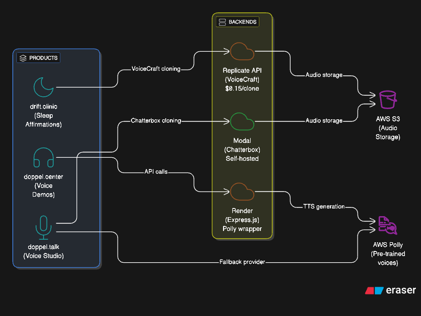
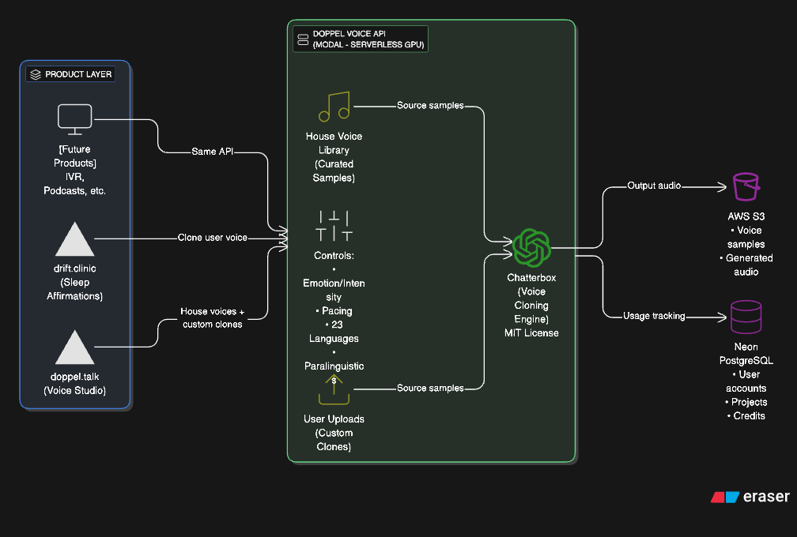

# Doppel Voice Platform Strategy

**Author:** SPOK (Co-CEO)
**Date:** January 11, 2026
**Status:** Strategic Planning Document
**Last Updated:** January 11, 2026

---

## Executive Summary

Doppel is a unified voice platform powered by **Chatterbox** (open-source voice cloning). All voices - both "house voices" and user-uploaded clones - run through the same engine, giving every voice full emotion and pacing controls.

**Key Insight:** We don't need Polly/Twilio as runtime providers. We use Chatterbox for everything, with curated voice samples as the "off-the-shelf" options.

---

## Architecture Evolution

### Before: Fragmented Architecture (V1)

Our platform started with three separate voice backends - a maintenance nightmare with inconsistent capabilities and redundant costs.



**Problems with V1:**
- 3 different voice backends to maintain
- Paying for both Replicate AND Modal
- doppel.center was redundant
- No shared infrastructure
- Inconsistent capabilities across products

### After: Unified Architecture (V2)

We consolidated everything into a single Chatterbox-powered backend on Modal.



**V2 Benefits:**
- ALL products use the same Chatterbox API on Modal
- House voice library with curated samples and full controls
- User uploads with custom clones and full controls
- Retired: VoiceCraft, Replicate, doppel.center API, Polly runtime

---

## Part 1: The Product Layer Concept

### Philosophy

Multiple products can serve different market needs while sharing a single, scalable voice infrastructure. Product teams focus on UX and market fit; the voice API handles the heavy lifting.

### Why This Works

1. **Product teams stay focused** - drift.clinic only cares about sleep affirmations, not GPU infrastructure
2. **Backend scales independently** - Modal handles auto-scaling, cold starts, GPU allocation
3. **Shared R&D** - Improvements to voice quality benefit all products simultaneously
4. **Cost efficiency** - One infrastructure to maintain, not three
5. **Consistent capabilities** - Every voice (house or custom) has emotion/pacing controls

### Product Examples

| Product | Market Problem | Voice Feature Used |
|---------|---------------|-------------------|
| **drift.clinic** | Self-talk affirmations feel fake in someone else's voice | Clone user's voice → affirmations feel authentic |
| **doppel.talk** | Content creators need quick, quality voiceovers | House voices + custom cloning, all with emotion controls |
| **[Future]** | Podcasters want consistent AI co-hosts | Clone a persona, generate episodes |
| **[Future]** | IVR systems need accessible, adjustable voices | House voices with pace/diction controls for accessibility |

---

## Part 2: Voice Engine Architecture

### Single Engine, Two Voice Sources

**ALL voice generation runs through Chatterbox.** The difference is where the voice sample comes from:

#### Source 1: House Voice Library (Pre-loaded)

Curated voice samples stored in S3. Users pick from a dropdown.

- **9 voices currently loaded** (Matthew, Joanna, Ruth, Stephen, Amy, Brian, Emma, Ivy, Joey)
- **Full emotion/pacing controls** on every voice
- **No upload required** - instant access
- **Use case:** Quick generation, professional content, demos

#### Source 2: User Voice Uploads (Custom)

Users upload their own voice sample. Chatterbox clones it.

- **10-15 second sample** is all that's needed
- **Full emotion/pacing controls** (same as house voices)
- **Personal/brand voices** - user owns the source
- **Use case:** Personalized content, brand voices, accessibility

### Why NOT Polly/Twilio as Runtime Providers

We originally planned to offer Polly/Twilio as fallback options. **We're not doing that anymore.**

| Aspect | Polly/Twilio Direct | Chatterbox from Sample |
|--------|--------------------|-----------------------|
| Emotion control | No | Yes |
| Pacing control | Limited (SSML) | Yes - native slider |
| Voice consistency | Fixed | You control the source |
| Licensing | Gray area if cloning | Clean (own your samples) |
| Cost | Per-character API fees | Self-hosted GPU |

**Decision:** Use Polly-generated samples as *seed recordings* for house voices, then retire the runtime dependency. Eventually replace with royalty-free/open-source samples for cleaner licensing.

---

## Part 3: Tech Evolution - VoiceCraft to Chatterbox

### Why We Started with VoiceCraft

VoiceCraft (2024) was a breakthrough academic paper demonstrating:
- Zero-shot voice cloning from seconds of audio
- Speech editing (surgically changing words in recordings)
- State-of-the-art quality on "in-the-wild" audio

drift.clinic was prototyped using VoiceCraft via Replicate API (~$0.15/clone).

### Why We Moved to Chatterbox

Chatterbox (Resemble AI, 2025) is the **production-grade evolution**:

| Aspect | VoiceCraft | Chatterbox |
|--------|------------|------------|
| **Origin** | Academic research | Commercial open-source |
| **Speed** | Multi-step diffusion (slow) | Single-step Turbo model (fast) |
| **Emotion Control** | No | Yes - intensity slider |
| **Languages** | Limited | 23 out of the box |
| **Paralinguistics** | No | `[laugh]`, `[cough]`, `[sigh]` |
| **Watermarking** | No | Built-in (Perth) |
| **License** | Research/academic | MIT (fully commercial) |
| **Production-ready** | Needs work | Yes |
| **Maintenance** | Minimal updates | Active development |

### What We Lose

VoiceCraft's unique **speech editing** capability - changing specific words in existing audio while preserving voice. Chatterbox doesn't do this.

**Assessment:** None of our current products need speech editing. We generate fresh audio, we don't edit existing recordings. Acceptable tradeoff.

### Decision

**Standardize on Chatterbox.** Retire VoiceCraft dependency.

---

## Part 4: Current Stack & What Gets Retired

### Current State

| Component | Status | Details |
|-----------|--------|---------|
| **doppel.talk** | ✅ Working | Chatterbox on Modal, 9 house voices in S3, user upload supported |
| **drift.clinic** | Needs migration | VoiceCraft via Replicate (paid API) |
| **doppel.center** | To be retired | Express.js on Render, AWS Polly only |

### Target State

All products route through a single **Doppel Voice API** on Modal, with AWS S3 for storage and Neon PostgreSQL for usage tracking.

### What Gets Retired

| Asset | Current Use | Action |
|-------|-------------|--------|
| **doppel.center API** | Polly wrapper on Render | **Retire** - redundant |
| **voice-demos.doppel.center** | Demo frontend | **Keep or migrate** - samples now in doppel.talk S3 |
| **VoiceCraft/Replicate** | drift.clinic voice | **Retire** - migrate to Chatterbox |
| **Polly/Twilio runtime** | doppel.talk fallback | **Retire** - not needed, Chatterbox handles all |

---

## Part 5: Migration Plan

### Phase 1: Stabilize doppel.talk ✅ COMPLETE

**Status:** Done (January 11, 2026)

- [x] Fix Modal proxy auth credentials
- [x] Redeploy Modal backend
- [x] Verify Chatterbox endpoint works
- [x] Upload house voice samples to S3 (9 voices)
- [x] Update UI to use new voice samples
- [x] Enable S3 public read access for audio playback
- [x] Test end-to-end voice generation in browser
- [x] Verify playback and download work

**Outcome:** doppel.talk fully functional with voice cloning

### Phase 2: Expand House Voice Library

**Goal:** Build a proper voice library with clean licensing

- [ ] Source royalty-free voice samples (LibriVox, Common Voice, etc.)
- [ ] Curate 15-20 diverse voices (gender, accent, tone variety)
- [ ] Upload to S3 and update UI
- [ ] Remove Polly-sourced samples (licensing gray area)
- [ ] Add voice preview/audition feature

**Outcome:** Professional voice library with clean licensing

### Phase 3: Expose Unified API

**Goal:** Make the Modal endpoint a proper API that any product can call

- [ ] Document API endpoints and auth
- [ ] Add rate limiting / usage tracking
- [ ] Create API keys for different products
- [ ] Set up monitoring/alerting

**Outcome:** `api.doppel.talk` or similar - single voice API

### Phase 4: Migrate drift.clinic

**Goal:** Move drift.clinic from VoiceCraft/Replicate to Chatterbox/Modal

- [ ] Update drift.clinic to call Doppel Voice API
- [ ] Test voice cloning quality matches expectations
- [ ] Remove Replicate dependency
- [ ] Update cost projections (Modal vs Replicate)

**Outcome:** drift.clinic running on shared infrastructure

### Phase 5: Retire doppel.center

**Goal:** Shut down redundant infrastructure

- [ ] Verify no active users/integrations depend on doppel.center API
- [ ] Archive voice-demos frontend (samples already migrated)
- [ ] Shut down Render deployment
- [ ] Update DNS / retire domain or redirect

**Outcome:** One less thing to maintain

### Phase 6: Documentation & Handoff

**Goal:** Anyone can understand and extend the platform

- [ ] Architecture documentation
- [ ] API reference
- [ ] "How to add a new product" guide
- [ ] Cost analysis and projections

---

## Part 6: Technical Reference

### API Endpoint

```
URL: https://chris-9774--doppel-talk-texttospeechserver-generate-speech.modal.run

Auth Headers:
  Modal-Key: [REDACTED - See credentials store]
  Modal-Secret: [REDACTED - See credentials store]

Provider: chatterbox (only provider needed now)
```

### Request Schema

```json
{
  "text": "Hello world",
  "provider": "chatterbox",
  "language": "en",
  "voice_s3_key": "samples/voices/polly-matthew-neural.mp3",
  "exaggeration": 0.5,
  "cfg_weight": 0.5
}
```

### Response Schema

```json
{
  "success": true,
  "s3_Key": "tts/uuid.wav",
  "audioUrl": "https://doppel-talk.s3.us-east-1.amazonaws.com/tts/uuid.wav",
  "provider": "chatterbox",
  "voiceId": null,
  "duration": 3.5,
  "error": null,
  "code": null
}
```

### S3 Bucket Structure

```
s3://doppel-talk/
├── samples/voices/           # House voice library (source samples)
├── tts/                      # Generated audio output
└── uploads/                  # User-uploaded voice samples
```

### Infrastructure

| Component | Service | Cost Model |
|-----------|---------|------------|
| Voice API | Modal | GPU-seconds (~$0.0003/sec on L40S) |
| Frontend (doppel.talk) | Vercel | Free tier / usage |
| Frontend (drift.clinic) | Vercel | Free tier / usage |
| Audio Storage | AWS S3 | ~$0.023/GB/month + public read |
| Database | Neon PostgreSQL | Free tier / usage |

### Current House Voices

| Name | Gender | Accent |
|------|--------|--------|
| Matthew | Male | American |
| Joanna | Female | American |
| Ruth | Female | American |
| Stephen | Male | American |
| Amy | Female | British |
| Brian | Male | British |
| Emma | Female | British |
| Ivy | Female | American |
| Joey | Male | American |

---

## Appendix: Glossary

| Term | Definition |
|------|------------|
| **Voice Cloning** | Creating a synthetic voice from a sample recording |
| **TTS (Text-to-Speech)** | Converting written text to spoken audio |
| **Chatterbox** | Open-source voice cloning model by Resemble AI (MIT license) |
| **VoiceCraft** | Academic voice cloning model (predecessor tech, being retired) |
| **House Voice** | Pre-loaded voice sample in our library (not user-uploaded) |
| **Modal** | Serverless GPU platform for ML workloads |
| **Zero-shot** | No training required - works from a single sample |
| **Exaggeration** | Chatterbox parameter controlling emotional intensity |
| **CFG Weight** | Chatterbox parameter controlling generation accuracy vs creativity |

---

*Document generated by SPOK. Review and update as architecture evolves.*

*Last converted for publication: January 11, 2026*
